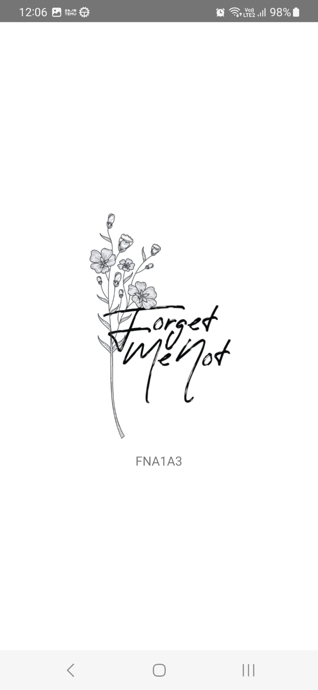
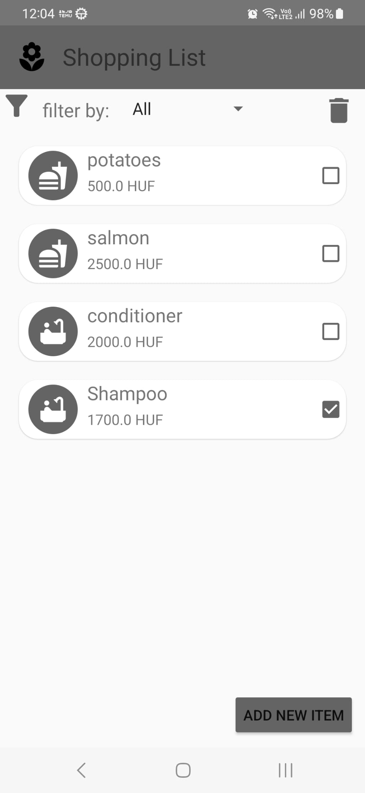
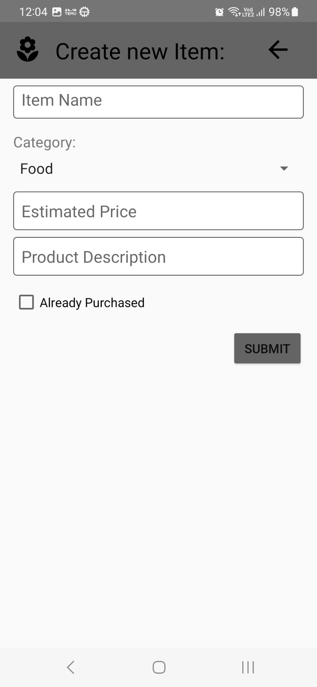
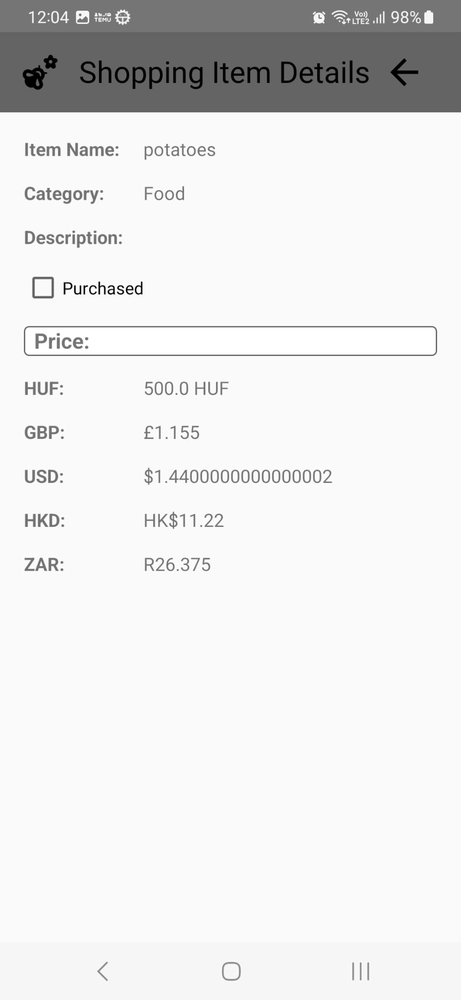
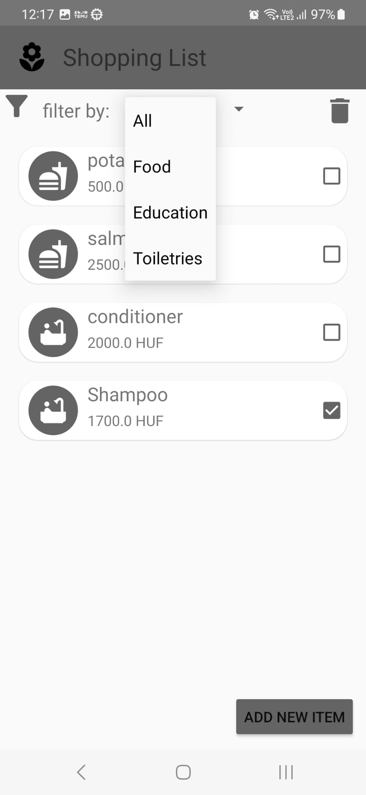
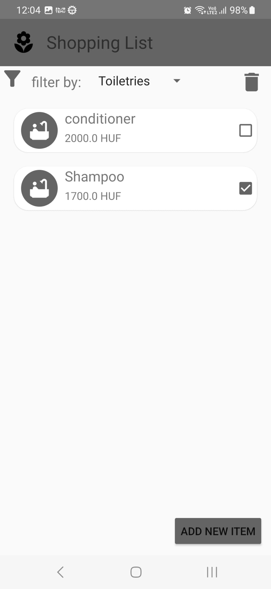

# Shopping List Application

The Shopping List application is designed to help users manage their shopping lists efficiently with a minimalist and clean user interface. The application includes several features that enhance the user experience, such as back button confirmation, filtering by category, and unified design components.

## Table of Contents
- [Introduction](#introduction)
- [Aesthetics and Design](#aesthetics-and-design)
- [Features](#features)
- [Technologies Used](#technologies-used)
- [Installation](#installation)
- [Usage](#usage)
- [Screenshots](#screenshots)

## Introduction

The Shopping List application allows users to create and manage shopping lists with ease. The app provides a user-friendly interface where users can add, edit, and delete items, filter items by category, and confirm actions before discarding changes.

## Aesthetics and Design

The application focuses on a minimalist and cohesive design. Key design elements include:
- **Unified Styles**: Consistent use of grey color for components like checkboxes and buttons.
- **Custom Borders**: Edit texts have an extra border added using a custom background XML file.
- **Circular Icons**: Icons in the shopping list activity are placed in circular backgrounds using another background XML file.

## Features

1. **Back Button Confirmation**  
   When the user tries to return to the shopping list activity before finishing a new item, a confirmation dialog is displayed to confirm if they wish to discard the item and return.

2. **Filtering by Category**  
   In the shopping list activity, users can filter items by category using a spinner below the toolbar. Items are filtered immediately when a new category is selected.

## Technologies Used

- **Front End and Logic**: Android Studio, Kotlin, XML  
- **Back End and Data Storage**: Local Storage

## Installation

1. Clone the repository: `https://github.com/JayWoodroffe/Shopping-List-Android-App.git`
2. Open the project in Android Studio.
3. Build and run the app on an Android device or emulator.

## Usage

1. **Add Items**: Enter item details and add them to the shopping list.  
2. **Filter Items**: Use the category filter to view items by specific categories.  
3. **Edit/Delete Items**: Edit or delete items as needed.  
4. **Back Button Confirmation**: Confirm discarding changes when navigating back from the new item activity.

## Screenshots

| Loading Activity | Shopping List Activity | New Item Activity |
|------------------|------------------------|-------------------|
|  |  |  |

| Item Details | Filter: All | Filter: Toiletries |
|--------------|-------------|---------------------|
|  |  |  |

| Filter: Food |
|--------------|
|  |
